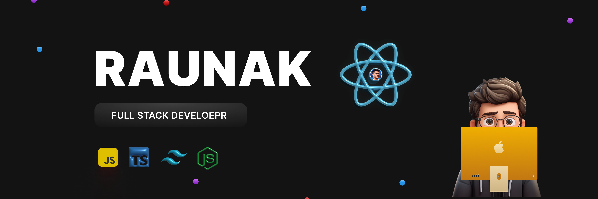

**`Full Stack Developer`**

I am a full stack web developer specializing in the MERN stack. My journey into coding began as a self-taught enthusiast, and over the years, I have honed my skills through relentless learning and experimentation with a variety of technologies. I am deeply passionate about creating dynamic and responsive web applications from the ground up. Additionally, I share my knowledge and insights by writing technical articles on <a href="https://raunak-mishra.hashnode.dev/" target="_blank">Hashnode</a>.

* 🌍  I'm based in India
* 🖥️  See my portfolio at [raunakmishra.me](http://raunakmishra.me)
* ✉️  You can contact me at [raunakmshraa.dev@gmail.com](mailto:raunakmshraa.dev@gmail.com)
* 🚀  I'm currently working on [Anonymous](https://github.com/raunak-mishraa/Anonymous)
* 🧠  I'm learning Full Stack + Devops
* ⚡  AI Enthusiast

### Skills

  

### Socials

 <a href="https://discord.com/users/raunak_mishra" target="_blank" rel="noreferrer"> <picture> <source media="(prefers-color-scheme: dark)" srcset="https://raw.githubusercontent.com/danielcranney/readme-generator/main/public/icons/socials/discord-dark.svg" /> <source media="(prefers-color-scheme: light)" srcset="https://raw.githubusercontent.com/danielcranney/readme-generator/main/public/icons/socials/discord.svg" />  </picture> </a> <a href="https://www.github.com/raunak-mishraa" target="_blank" rel="noreferrer"> <picture> <source media="(prefers-color-scheme: dark)" srcset="https://raw.githubusercontent.com/danielcranney/readme-generator/main/public/icons/socials/github-dark.svg" /> <source media="(prefers-color-scheme: light)" srcset="https://raw.githubusercontent.com/danielcranney/readme-generator/main/public/icons/socials/github.svg" />  </picture> </a> <a href="https://raunak-mishra.hashnode.dev" target="_blank" rel="noreferrer"> <picture> <source media="(prefers-color-scheme: dark)" srcset="https://raw.githubusercontent.com/danielcranney/readme-generator/main/public/icons/socials/hashnode-dark.svg" /> <source media="(prefers-color-scheme: light)" srcset="https://raw.githubusercontent.com/danielcranney/readme-generator/main/public/icons/socials/hashnode.svg" />  </picture> </a> <a href="https://www.linkedin.com/in/raunak-mishraa" target="_blank" rel="noreferrer"> <picture> <source media="(prefers-color-scheme: dark)" srcset="https://raw.githubusercontent.com/danielcranney/readme-generator/main/public/icons/socials/linkedin-dark.svg" /> <source media="(prefers-color-scheme: light)" srcset="https://raw.githubusercontent.com/danielcranney/readme-generator/main/public/icons/socials/linkedin.svg" />  </picture> </a> <a href="https://www.x.com/Raunak_devs" target="_blank" rel="noreferrer"> <picture> <source media="(prefers-color-scheme: dark)" srcset="https://raw.githubusercontent.com/danielcranney/readme-generator/main/public/icons/socials/twitter-dark.svg" /> <source media="(prefers-color-scheme: light)" srcset="https://raw.githubusercontent.com/danielcranney/readme-generator/main/public/icons/socials/twitter.svg" />  </picture> </a> <a href="https://www.youtube.com/@devwithraunak" target="_blank" rel="noreferrer"> <picture> <source media="(prefers-color-scheme: dark)" srcset="https://raw.githubusercontent.com/danielcranney/readme-generator/main/public/icons/socials/youtube-dark.svg" /> <source media="(prefers-color-scheme: light)" srcset="https://raw.githubusercontent.com/danielcranney/readme-generator/main/public/icons/socials/youtube.svg" />  </picture> </a> <a href="https://www.threads.net/@mishraa.raunak" target="_blank" rel="noreferrer"> <picture> <source media="(prefers-color-scheme: dark)" srcset="https://raw.githubusercontent.com/danielcranney/readme-generator/main/public/icons/socials/threads-dark.svg" /> <source media="(prefers-color-scheme: light)" srcset="https://raw.githubusercontent.com/danielcranney/readme-generator/main/public/icons/socials/threads.svg" />  </picture> </a>

### Badges

<b>My GitHub Stats</b>

